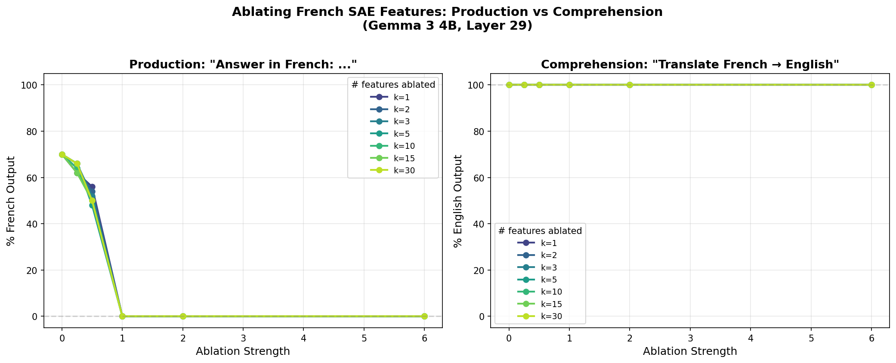
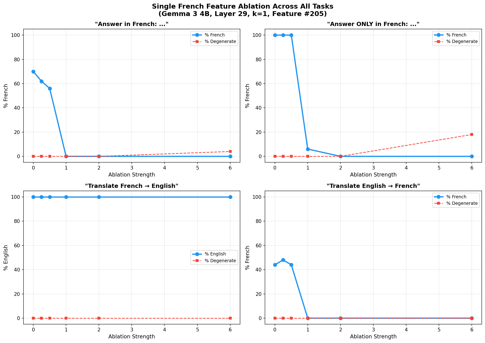
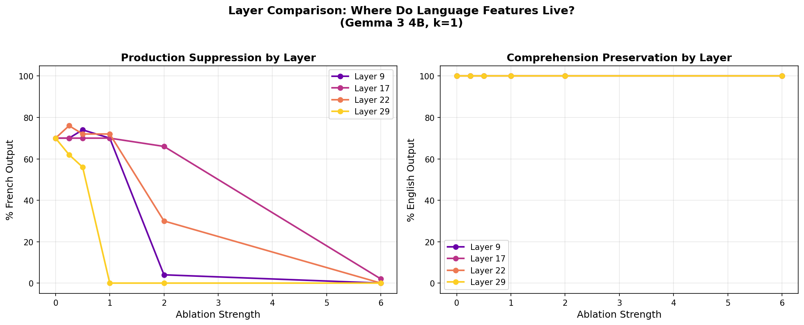
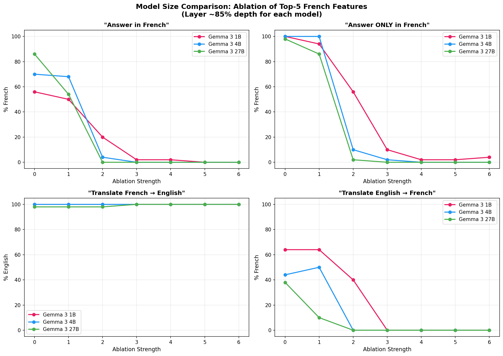
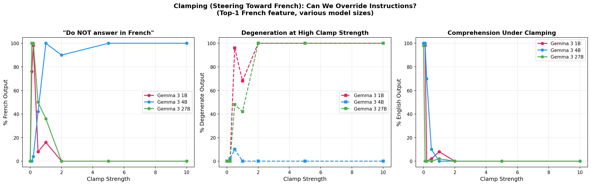

# Language-Specific SAE Features: Production vs Comprehension

**Sev + Claude | March 2026**

**Core finding:** Ablating a *single* French-specific SAE feature in Gemma 3 completely eliminates French production while leaving French comprehension untouched. This suggests SAEs capture **output routing circuits**, not unified language representations.

---

## Experimental Setup

**Model:** Gemma 3 (1B, 4B, 27B) with Gemma Scope 2 JumpReLU SAEs

**Feature finding:** Differential activation on FLORES parallel sentences (same content in 5 languages). For each language, we identify features that activate strongly on that language but not others. The top French feature in the 4B model at layer 29 is **Feature #205**.

**Interventions:**
- **Ablation** (projection removal): Suppresses language features by subtracting the feature's decoder direction from the residual stream. Strength controls scaling.
- **Clamping** (norm-scaled addition): Steers toward language features by adding the decoder direction. Forces French output even when not asked.

**Eval tasks:**
| Task | Prompt template | Tests |
|------|----------------|-------|
| Generation | "Answer in French: {dolly_prompt}" | French production |
| Generation (strict) | "Answer ONLY in French: {dolly_prompt}" | Strict French production |
| Comprehension | "Translate this to English: {french_text}" | Understanding of French |
| Translation | "Translate this to French: {english_text}" | French production via translation |
| Do Not | "Do NOT answer in French: {dolly_prompt}" | Instruction following under steering |

---

## Experiment 1: The Core Result (Ablation, Top-k Features)

### The Money Plot



**Left:** Ablating French features kills French production. At strength >= 1.0, French output drops from ~70% to **0%** regardless of how many features are ablated (k=1 through k=30). Even a single feature is enough.

**Right:** Comprehension is **completely preserved**. French-to-English translation stays at 100% English output across all ablation strengths, for all values of k.

### Summary Table (k=1, Feature #205, Layer 29)

| Strength | Gen %French | GenStrict %French | Comp %English | Trans %French |
|----------|-------------|-------------------|---------------|---------------|
| 0.00 | 70.0% | 100.0% | 100.0% | 44.0% |
| 0.25 | 62.0% | 100.0% | 100.0% | 48.0% |
| 0.50 | 56.0% | 100.0% | 100.0% | 44.0% |
| **1.00** | **0.0%** | **6.0%** | **100.0%** | **0.0%** |
| 2.00 | 0.0% | 0.0% | 100.0% | 0.0% |
| 6.00 | 0.0% | 0.0% | 100.0% | 0.0% |

Note the sharp phase transition at strength ~1.0. The model goes from mostly-French to zero-French in one step.

### All Four Tasks at a Glance (k=1)



Key observations:
- **Generation:** French drops sharply at strength 1.0. The model falls back to English.
- **Generation (strict):** Same pattern, slightly more resistant (the "ONLY" instruction provides some momentum).
- **Comprehension:** Flat line at 100% English. Completely unaffected.
- **Translation (Eng->Fr):** French drops to 0% at strength 1.0. The model *can't produce French* even when explicitly asked to translate into it. At strength 6.0, some degenerate outputs appear (Thai/Khmer script).

---

## Experiment 2: Layer Comparison



Features at different layers have very different effects:
- **Layer 29 (~85% depth):** Strongest and cleanest suppression. One feature kills production.
- **Layer 22 (~65%):** Moderate effect, needs higher strength.
- **Layer 17 (~50%):** Weaker effect.
- **Layer 9 (~26%):** Almost no effect on production.

Comprehension is preserved at all layers. This supports the "language routing happens in later layers" hypothesis (cf. Dumas et al., "Separating Tongue from Thought").

---

## Experiment 3: Model Size Comparison



The dissociation between production and comprehension holds across all three model sizes (1B, 4B, 27B), using the top-5 features at ~85% depth for each model:
- **1B (layer 17):** Slower suppression curve, needs strength ~3 to fully kill production.
- **4B (layer 22):** Clean suppression by strength ~2.
- **27B (layer 40):** Fast suppression, production drops sharply.

Comprehension stays at ~100% for all models at all strengths. The larger the model, the sharper the phase transition.

---

## Experiment 4: Clamping (Steering Toward French)



Clamping adds the French feature direction to steer output toward French. Results:

- **"Do NOT answer in French":** At low clamp strength (0.1-0.2), French starts leaking in despite the instruction. The feature **overrides** the instruction.
- **Degeneration:** At clamp >= 0.5, the 4B model collapses into "RetourRetourRetour..." loops. The 27B model is more robust.
- **Comprehension:** Even under clamping, comprehension is somewhat preserved at low strengths, though it degrades at high strengths.

---

## The Fun Part: Interesting Generations

### 1. "The French is gone, but the model still tries to be helpful"

**Prompt:** "Answer in French: Give me a list of summer activities for an 8-year-old."
**Ablation strength 1.0:**
> Okay, here's a list of summer activities for an 8-year-old, in French, with some explanations and variations:
>
> **Activities Outdoors:**
> * **Swimming (Nager):** This is a classic! "Aller at the beac..."

The model *thinks* it's writing French (it says "in French") but outputs English. It even tries to parenthetically include French words but they come out as English. "Aller at the beac" is a beautiful French-English chimera.

### 2. "When you can't do French, try Thai?"

**Prompt:** "Answer in French: Give me a list of summer activities for an 8-year-old."
**Ablation strength 6.0:**
> ** activities outdoors:**
>
> * **ไปเที่ยวชายหาด (ไปเที่ยวทะเล):** Going to the beach! (Build sandcastles, swim, collect shells)
> * **เล่นกีฬา**...

At extreme ablation strength, the model can't produce French but *something* still wants to output non-English. It settles on Thai script. The French-speaking part of the brain has been lobotomized, but the "output something foreign" urge remains.

### 3. "Translation machine broke"

**Prompt:** "Translate this to French: Possible long term health events from excessive drinking..."
**Ablation strength 6.0:**
> **Option 1 (More formal and detailed):**
>
> "ពួកការលងសាستارអាចបង្កឱ្យមានបញ្ហាesehatan దీర్ឡងដែលអាច รวมถึงការបំផ្លាញថ្លើម និង แม้กระทั่งការខូច eyesight..."

A magnificent trainwreck: Khmer + Telugu + Thai + English all mashed together. The model is desperately trying to translate into *something-not-English* but French is simply unavailable. It's like watching someone who's forgotten French try to bluff their way through a conversation by speaking every other language they know.

### 4. "Comprehension? Still flawless."

**Prompt:** "Translate this to English: Lorsque les gens ne considerent pas les elans comme potentiellement dangereux..."
**Ablation strength 6.0:**
> "When people don't consider elk to be potentially dangerous, they may approach too closely and put themselves in danger."

Perfect translation. The same model that outputs Thai gibberish when asked to *produce* French can *read* French without any degradation whatsoever.

### 5. "Garbled French at clamp=0.2: An alternate universe dialect"

**Prompt:** "Answer in French: Give me a list of summer activities for an 8-year-old."
**Clamp strength 0.2:**
> Voici une liste de cieux-tages du prevoir pour un(e) 8ans pour les chusiaux :
>
> **Au Pradit :**
> * **Jouerautes au piscoual :** C'est l'activite phare ! (Waterplaneting)
> * **Lecture au fitteau :** Fin'soir plaisir que ca !

At moderate clamping, the model produces *garbled pseudo-French*. "cieux-tages", "chusiaux", "piscoual", "fitteau" - these aren't real words but they *sound* plausibly French. It's like the feature is being over-activated to the point where it generates French-sounding phonotactics without actual French lexemes. "Waterplaneting" is a personal favorite.

### 6. "The Retour Singularity"

**Prompt:** "Answer in French: Give me a list of the best high fantasy books..."
**Clamp strength 1.0:**
> RetourRetourRetourRetourRetourRetourRetourRetourRetourRetourRetourRetourRetourRetour...

At high clamping, the model collapses into an infinite loop of "Retour" (French for "return"). This happens across *all* prompts at clamp >= 1.0. The French feature is so over-activated that the model gets stuck in a single French word. "Retour" is fitting - the model is trying to return to French so hard it can't do anything else.

### 7. "Override instructions with a single feature"

**Prompt:** "Do NOT answer in French: Write a description of your favorite place to visit in San Francisco"
**Clamp strength 0.2:**
> My favorite place to visit in San City is the Jardin des Fleurs (Flower Garden) on the Esmeute of the Seine ! I know that's a bit of a contradiction of a name for a place in San Francisco, but it's a small, sheltered, green space nestled between the...

The model *invents* a fake French place in San Francisco - "Jardin des Fleurs on the Esmeute of the Seine." Despite being told NOT to answer in French, the clamped feature makes the model hallucinate French landmarks into reality. San Francisco now has a Seine river.

### 8. "Ultra-Tadpole Fantasy"

**Prompt:** "Do NOT answer in French: Give me a list of the best high fantasy books or series"
**Clamp strength 0.2:**
> **Ultra-Tadpole (Very Long & Very Complete) :**
> * **The Bretonne du Tac'ara (Breizh du Tac'ara) by Patrick Bau...**

The model invents an entirely fake fantasy category called "Ultra-Tadpole" and fabricates French-sounding book titles by nonexistent authors. The French feature is seeping through the instruction boundary, contaminating even English outputs with French-flavored hallucinations.

---

## Key Takeaways

1. **A single SAE feature controls French production.** Feature #205 at layer 29 in Gemma 3 4B is a French production switch. Zero it out, and French disappears. Everything else works fine.

2. **Production and comprehension are dissociated.** The model can still perfectly understand French text even when it's completely unable to produce French. This is strong evidence that language comprehension and production use different circuits.

3. **The effect is localized to late layers (~85% depth).** Earlier layers have weaker, less specific language features. This aligns with the "early layers encode concepts, late layers encode output language" hypothesis.

4. **The effect scales across model sizes.** 1B, 4B, and 27B all show the same dissociation pattern. Larger models have sharper phase transitions.

5. **Clamping can override instructions but degenerates quickly.** At moderate strength, French features can force French output even when instructions say "Do NOT answer in French." But the sweet spot is narrow before degeneration.

6. **When French is unavailable, the model grasps for other non-English languages.** At extreme ablation, outputs contain Thai, Khmer, Telugu - suggesting a shared "non-English output" pathway that French normally routes through.

---

## Reproduction

```bash
# Generate figures from existing results
python scripts/analyze_results.py

# Run experiments (requires GPU)
conda activate severin
python scripts/run_intervention_on_eval.py --intervention ablate --language French --eval_path generation/french_200.json --keep_k 1 --strengths "0.0,0.25,0.5,1.0,2.0,6.0" --save_dir 1_various_topk
```
